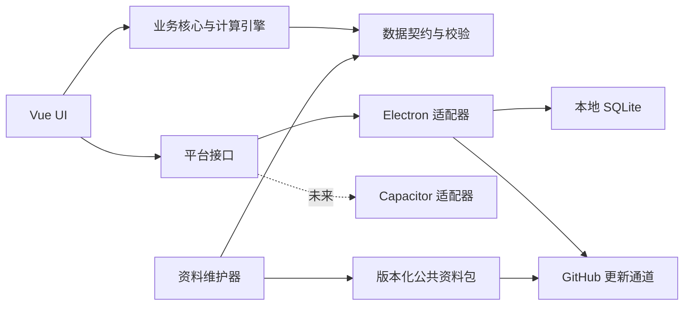

# 架构方案

状态：初稿

## 技术方向

- UI：Vue 3、TypeScript、Vite。
- Windows 容器：Electron，使用 electron-vite 构建。
- 未来 Android 容器：Capacitor；不纳入当前交付。
- 仓库：pnpm workspace monorepo。
- 数据库：SQLite；Windows 使用 Electron 所含 Node 24 的内置 `node:sqlite`，未来 Android 使用平台适配器执行同一逻辑 schema。
- 数据契约：版本化 schema、稳定实体 ID、结构校验与校验和。
- 测试：计算规则单元测试、数据库迁移测试、组件测试和桌面端端到端测试。
- 基础运行环境：Node.js 24、pnpm 11 workspace。

选择 Vue 3 + TypeScript 是因为它适合高密度工具界面，具有正式的 TypeScript 支持，并可让 Electron 与未来 Capacitor 共享绝大部分 UI 和业务代码。

## 目标目录

```text
apps/
  desktop/       Electron Windows 客户端
  maintainer/    Windows 资料维护器
packages/
  core/          纯 TypeScript 业务规则与计算引擎
  database/      本地数据库、迁移与备份
  data-schema/   公共资料格式、验证和合并规则
  ui/            可跨容器复用的 Vue UI
  platform/      文件、更新、通知等平台接口
content/         可公开维护的基础资料与远程清单
docs/            产品、架构、规则和维护文档
fixtures/        经过脱敏的旧版迁移与回归测试样本
```

## 边界



`packages/core` 不得导入 Electron、Node 文件系统或浏览器 UI API。计算规则以纯函数和显式规则版本实现，确保桌面端、维护器、测试和未来 Android 使用同一结果。

## 数据分层

1. 公共基础层：物品、配方、纳米、食谱、图谱、活动和快报元数据。
2. 用户覆盖层：售价、关注、采购方式、解锁状态、用户新增或修改内容。
3. 派生层：成本、利润、排名和统计结果，可重建，不作为唯一事实来源。

公共更新只替换公共基础层。用户覆盖层使用稳定实体 ID 关联；实体删除或拆分时通过迁移映射处理，不按名称猜测关联。

## 安全基线

- Renderer 禁用 Node integration，启用 context isolation 和 sandbox。
- Preload 只暴露最小、类型化、可验证的 IPC API。
- 每个 IPC 调用验证发送方、参数和权限。
- 使用严格 Content Security Policy。
- 禁止加载和执行远程 JavaScript。
- 外部链接经白名单验证后交给系统浏览器。
- 远程数据包验证 schema、大小限制、版本、哈希和资源类型。
- 更新失败采用事务回滚，保留上一份有效数据。

## 待验证决策

- SQLite 驱动在 Electron 打包、便携模式和未来 Android 适配中的组合。
- 安装器与便携包使用 electron-builder；NSIS 安装版与 portable 单文件已完成骨架验证。
- 无签名条件下客户端更新的安全确认与用户体验。
- GitHub 数据发布使用 Releases、静态分支，或二者结合。
